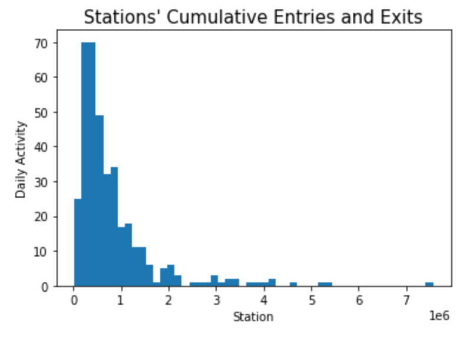

# MVP - Advertising NYC Electronics Drop Off Locations
The goal of this project is to help the city better advertise its electronic drop-off locations, particularly to the large crowds of subway traffic and the metro stations that are closest to the locations. 
To start exploring this goal, I analyzed the daily activity (total number of entries and exits) of NYC's metro stations and found the stations with the total highest amount of traffic, and made a histogram showing these results.

From here on, I plan to analyze this data along with the other data I have: the zipcode of every single drop-off box as well as the zipcodes of every single metro station. I will use SQL to find the ratio of people to dropbox in a single zipcode to determine which ratio is the lowest, and thus make recommendations to the city as zipcodes with these lower ratios will have a smaller chance of the box filling up.
